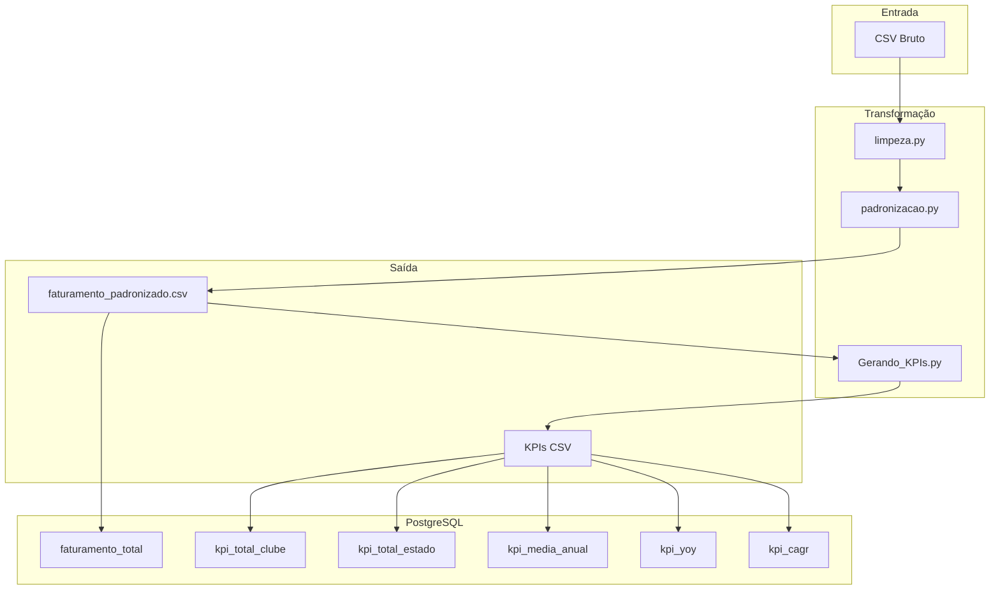

# Pipeline de Faturamento de Clubes — ETL & KPIs

## Visão Geral

Este projeto implementa um pipeline ETL completo para processamento de dados de faturamento de clubes, cobrindo desde a limpeza e padronização dos dados brutos até a geração de KPIs analíticos e armazenamento estruturado no PostgreSQL.

### Etapas do Pipeline

| Etapa                   | Descrição                                              | Script                      |
|-------------------------|--------------------------------------------------------|-----------------------------|
| **Limpeza**             | Remoção de inconsistências e valores inválidos         | `limpeza.py`                |
| **Padronização**        | Normalização de formatos e nomes                       | `padronizacao.py`           |
| **Geração de KPIs**     | Cálculo de métricas analíticas por clube e estado      | `Gerando_KPIs.py`           |
| **Importação de Dados** | Carga dos dados brutos no PostgreSQL                   | `Import_CSV_PostgreSQL.py`  |
| **Importação de KPIs**  | Carga dos KPIs gerados no PostgreSQL                   | `Import_KPIs_PostgreSQL.py` |

### Fluxo de Processamento

1. **Limpeza** — Lê os dados brutos e remove registros inconsistentes ou nulos
2. **Padronização** — Normaliza colunas, formatos de data e nomenclaturas
3. **Geração de KPIs** — Calcula totais, médias, CAGR e crescimento YoY por clube e estado
4. **Criação das tabelas** — Executa o DDL no PostgreSQL via `POSTGRESQL.sql`
5. **Importação** — Carrega os dados brutos e os KPIs nas tabelas correspondentes

---

### Dependências

Instale as dependências com:

```bash
pip install pandas psycopg2-binary sqlalchemy python-dotenv
```

Dependências principais:

- `pandas` — Manipulação e transformação de dados
- `psycopg2-binary` — Driver PostgreSQL para Python
- `sqlalchemy` — ORM e abstração de conexão com o banco
- `python-dotenv` — Leitura de variáveis de ambiente via `.env`

**Requisitos de ambiente:**

- Python >= 3.8
- PostgreSQL >= 12

---

## Estrutura do Projeto

```plaintext
.
├── limpeza.py                  # Limpeza dos dados brutos
├── padronizacao.py             # Padronização e normalização
├── Gerando_KPIs.py             # Cálculo e exportação dos KPIs
├── Import_CSV_PostgreSQL.py    # Importação dos dados brutos para o PostgreSQL
├── Import_KPIs_PostgreSQL.py   # Importação dos KPIs para o PostgreSQL
├── teste_conexao.py            # Validação da conexão com o banco
├── POSTGRESQL.sql              # DDL das tabelas + queries analíticas prontas
└── .env                        # Variáveis de ambiente (não versionado)
```

---

## Configuração

### Variáveis de Ambiente (`.env`)

```env
# Caminhos de dados
INPUT_CSV=./data/faturamento_padronizado.csv
OUTPUT_DIR=./data/kpis
CSV_PATH=./data/faturamento_padronizado.csv

# Conexão PostgreSQL (SQLAlchemy)
POSTGRES_USER=seu_usuario
POSTGRES_PASSWORD=sua_senha
POSTGRES_HOST=localhost
POSTGRES_PORT=5432
POSTGRES_DB=nome_do_banco

# Conexão PostgreSQL (psycopg2)
PG_USER=seu_usuario
PG_PASSWORD=sua_senha
PG_HOST=localhost
PG_PORT=5432
PG_DATABASE=nome_do_banco
TABLE_NAME=faturamento_total
```

> O arquivo `.env` não é versionado e não deve ser enviado ao repositório.

---

## Execução

### 1. Preparar os dados

```bash
python limpeza.py
python padronizacao.py
```

### 2. Gerar KPIs

```bash
python Gerando_KPIs.py
```

Gera os seguintes arquivos em `./data/kpis/`:

| Arquivo               | Descrição                              |
|-----------------------|----------------------------------------|
| `kpi_total_clube.csv` | Faturamento total por clube            |
| `kpi_total_estado.csv`| Faturamento total por estado           |
| `kpi_media_anual.csv` | Média anual de faturamento por clube   |
| `kpi_yoy.csv`         | Crescimento ano a ano (YoY)            |
| `kpi_cagr.csv`        | Crescimento anual composto (CAGR)      |

### 3. Criar tabelas no banco

```bash
psql -U seu_usuario -d nome_do_banco -f POSTGRESQL.sql
```

### 4. Testar conexão

```bash
python teste_conexao.py
```

### 5. Importar dados

```bash
python Import_CSV_PostgreSQL.py
python Import_KPIs_PostgreSQL.py
```

> **Atenção:** `Import_CSV_PostgreSQL.py` utiliza `if_exists="replace"`, sobrescrevendo os dados a cada execução.

---

## Tabelas no PostgreSQL

### `faturamento_total` — Dados Brutos

Armazena o dataset completo após limpeza e padronização, servindo como fonte única de verdade para todas as análises.

### Tabelas de KPIs

| Tabela             | Descrição                                      |
|--------------------|------------------------------------------------|
| `kpi_total_clube`  | Faturamento total acumulado por clube          |
| `kpi_total_estado` | Faturamento total acumulado por estado         |
| `kpi_media_anual`  | Média anual de faturamento por clube           |
| `kpi_cagr`         | Taxa de crescimento anual composta por clube   |
| `kpi_yoy`          | Variação percentual de faturamento ano a ano   |

---

## Queries Úteis

### Top 10 clubes por faturamento

```sql
SELECT clube, to_char(total_faturamento, 'L999G999G999G990D00') AS faturamento
FROM kpi_total_clube
ORDER BY total_faturamento DESC
LIMIT 10;
```

### Top 10 maiores crescimentos (CAGR)

```sql
SELECT clube, REPLACE(TO_CHAR(cagr * 100, 'FM990D99'), '.', ',') || '%' AS crescimento
FROM kpi_cagr
WHERE cagr IS NOT NULL
ORDER BY cagr DESC
LIMIT 10;
```

> O arquivo `POSTGRESQL.sql` contém queries prontas para ranking, participação percentual, comparação com média, faixas de faturamento e análise de CAGR.

---

## Diagrama de Arquitetura



---

## Observações

- O pipeline é **idempotente por substituição**: reexecutar `Import_CSV_PostgreSQL.py` sobrescreve a tabela `faturamento_total` integralmente
- As variáveis de ambiente estão duplicadas (prefixos `POSTGRES_` e `PG_`) para compatibilidade com SQLAlchemy e psycopg2 respectivamente
- Recomenda-se executar `teste_conexao.py` antes de qualquer importação para validar as credenciais e o host do banco
